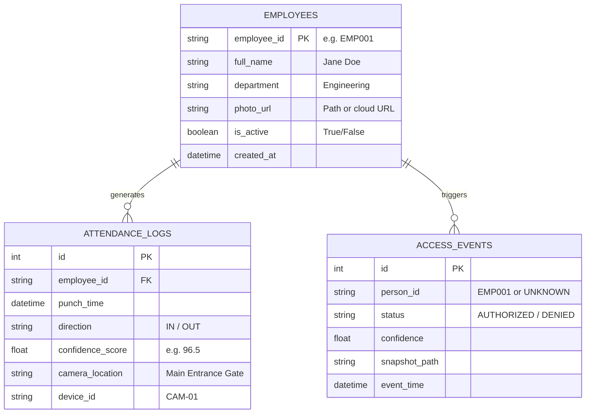
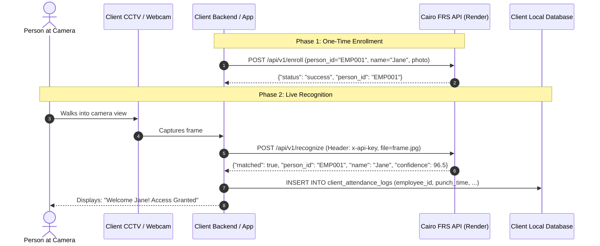

# Face Recognition API Engine — Client Integration & Database Guide

> **Document Version:** 1.0  
> **Target Audience:** Client Developers, System Integrators, IT & Database Administrators  
> **API Server Environment:** Hosted on Render Cloud (`https://<your-app-name>.onrender.com`)

---

## 1. Overview for the Client

As a client of the **Cairo Face Recognition API Engine**, you **do not need any machine learning models, GPU hardware, or complex vector databases** on your servers. 

The API engine handles:
- AI-based face detection
- High-precision facial landmark alignment
- 128-dimensional biometric embedding extraction
- Sub-50ms 1:N vector gallery searching
- Multi-tenant data isolation (your data is 100% private to your API key)

Your application simply sends images to the API URL with your secret API key in the header, and receives structured JSON with the recognized person, confidence score, and bounding boxes.

---

## 2. What Credentials the Client Receives

When onboarded, you are provided with:

| Parameter | Example Value | Description |
|---|---|---|
| **Base API URL** | `https://frs-api-engine.onrender.com/api/v1` | Root endpoint for all API requests |
| **API Key** | `frs_live_47796b386184c394b67f39ae45d7...` | Your secret authorization token |
| **Header Name** | `x-api-key` | HTTP header where your key must be passed |
| **Interactive Docs** | `https://frs-api-engine.onrender.com/docs` | Swagger UI to test endpoints live |

---

## 3. What Database Does the Client Need to Make?

The client only needs to store **their own business records** (Employees, Visitors, Access Logs, and Attendance).

Here is the recommended **Client-Side Database Schema** (MySQL / PostgreSQL / SQLite / SQL Server).

### 3.1 Recommended Client-Side Tables



### 3.2 Client Database SQL Scripts

#### For MySQL / MariaDB:

```sql
-- 1. Client's Registered Persons / Employees Table
CREATE TABLE IF NOT EXISTS client_employees (
    employee_id VARCHAR(50) PRIMARY KEY,      -- Matches person_id enrolled in the API
    full_name VARCHAR(150) NOT NULL,
    department VARCHAR(100),
    job_title VARCHAR(100),
    email VARCHAR(100),
    phone VARCHAR(30),
    is_active BOOLEAN DEFAULT TRUE,
    created_at DATETIME DEFAULT CURRENT_TIMESTAMP
) ENGINE=InnoDB;

-- 2. Client's Real-Time Recognition & Attendance Logs
CREATE TABLE IF NOT EXISTS client_attendance_logs (
    log_id BIGINT AUTO_INCREMENT PRIMARY KEY,
    employee_id VARCHAR(50) NULL,             -- NULL if 'Unknown' face
    person_name VARCHAR(150) NOT NULL,        -- 'Unknown' or recognized name
    confidence_score DECIMAL(5, 2) NOT NULL,  -- e.g. 94.50 (%)
    status ENUM('PRESENT', 'UNKNOWN_VISITOR', 'ACCESS_DENIED') DEFAULT 'PRESENT',
    camera_id VARCHAR(50) DEFAULT 'GATE-1',
    punch_time DATETIME DEFAULT CURRENT_TIMESTAMP,
    snapshot_filename VARCHAR(255) NULL,      -- Local saved snapshot for audit
    FOREIGN KEY (employee_id) REFERENCES client_employees(employee_id) ON DELETE SET NULL,
    INDEX idx_emp_time (employee_id, punch_time)
) ENGINE=InnoDB;
```

---

## 4. Client Integration Workflow (Step-by-Step)



---

## 5. Client Code Examples

### 5.1 Python Client Example (Attendance Punch Script)

```python
import requests
import datetime
import mysql.connector

# Configuration
API_URL = "https://<your-app-name>.onrender.com/api/v1/recognize"
API_KEY = "frs_live_47796b386184c394b67f39ae45d7018d86103e96"

def punch_attendance_from_image(image_path, camera_id="MAIN_GATE_1"):
    headers = {
        "x-api-key": API_KEY
    }
    
    with open(image_path, "rb") as img_file:
        files = {"file": (image_path, img_file, "image/jpeg")}
        response = requests.post(API_URL, headers=headers, files=files, timeout=10)
    
    if response.status_code != 200:
        print(f"API Error ({response.status_code}):", response.text)
        return

    data = response.json()
    print(f"Detected {data['faces_detected']} face(s) in {data['processing_time_ms']} ms")

    for face in data["results"]:
        if face["matched"]:
            emp_id = face["person_id"]
            name = face["name"]
            confidence = face["confidence"]
            print(f"[ACCESS GRANTED] Welcome {name} (ID: {emp_id}) — Match: {confidence}%")
            
            # Save to client's local database
            save_to_local_db(emp_id, name, confidence, camera_id)
        else:
            print(f"[UNKNOWN VISITOR] Unrecognized person detected! Alert triggered.")

def save_to_local_db(emp_id, name, confidence, camera_id):
    conn = mysql.connector.connect(
        host="localhost", user="root", password="your_password", database="client_hrms"
    )
    cursor = conn.cursor()
    cursor.execute("""
        INSERT INTO client_attendance_logs (employee_id, person_name, confidence_score, camera_id)
        VALUES (%s, %s, %s, %s)
    """, (emp_id, name, confidence, camera_id))
    conn.commit()
    cursor.close()
    conn.close()

# Run
if __name__ == "__main__":
    punch_attendance_from_image("cctv_frame.jpg")
```

---

### 5.2 Node.js / JavaScript Client Example

```javascript
const fs = require('fs');


recognizePerson('sample.jpg');
```

---

### 5.3 cURL / Shell Example

```bash
curl -X POST "https://<your-app-name>.onrender.com/api/v1/recognize" \
  -H "x-api-key: frs_live_47796b386184c394b67f39ae45d7018d86103e96" \
  -F "file=@cctv_snapshot.jpg"
```

---

## 6. Complete API Reference for the Client

### 6.1 `POST /api/v1/recognize` (1:N Search)
- **Header:** `x-api-key: <client_key>`
- **Body:** `file` (multipart/form-data)
- **Optional Params:** `tolerance` (default `0.40`), `image_base64`
- **Output:**
  ```json
  {
    "status": "success",
    "processing_time_ms": 38.4,
    "faces_detected": 1,
    "results": [
      {
        "box": {"top": 120, "right": 340, "bottom": 410, "left": 150},
        "matched": true,
        "person_id": "EMP001",
        "name": "Jane Doe",
        "confidence": 96.5,
        "distance": 0.22,
        "metadata": {"job_profile": "Senior Engineer"}
      }
    ]
  }
  ```

### 6.2 `POST /api/v1/enroll` (Register New Person)
- **Header:** `x-api-key: <client_key>`
- **Body:**
  - `person_id`: Unique external ID (e.g. `EMP-104`)
  - `name`: Full Name (e.g. `John Smith`)
  - `file`: Clear face photo
  - `metadata`: Optional JSON string (e.g. `{"department": "HR"}`)

### 6.3 `POST /api/v1/verify` (1:1 Verification)
- **Header:** `x-api-key: <client_key>`
- **Body:**
  - `file1`: Primary photo
  - `file2`: Secondary photo (or `person_id`: enrolled ID)
- **Output:** Returns `{"is_match": true, "similarity": 98.2%}`

### 6.4 `GET /api/v1/identities` (List Enrolled Gallery)
- Returns array of all enrolled IDs, names, and face counts.

### 6.5 `DELETE /api/v1/identities/{person_id}` (Delete Face)
- Deletes an enrolled person from the recognition database.

---

## 7. Troubleshooting & FAQ

1. **What if the client gets `401 Unauthorized`?**
   - Verify that the `x-api-key` header is included and matches the client's assigned key exactly.
2. **What if the person is detected as `"Unknown"`?**
   - Check if the person was enrolled via `/api/v1/enroll`.
   - Ensure the lighting is clear and the face is at least 60x60 pixels.
   - You can slightly relax the `tolerance` (e.g., set `tolerance=0.45` instead of `0.40`).
3. **Can multiple faces in one photo be recognized?**
   - Yes! The `results` array contains an entry for every face detected in the frame.
